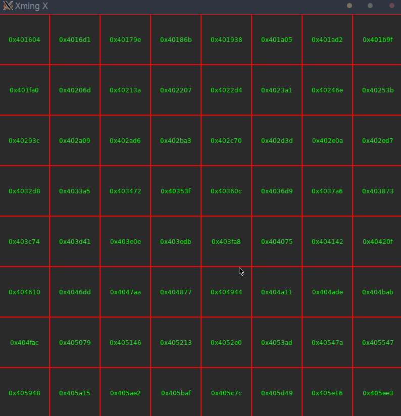

# lost-again-ctf

### My solution for a **really difficult** CTF

ctf host: [cbak.is](https://www.cbak.is)

ctf problem: Lost Again

###### gist of the problem:
A raw binary executable is given. When ran, this executable prompts the user for input. Not much can be figured out until you disassemble the executable wherein you will find (after hours upon hours of deciphering assembly code) that there is a hidden chessboard within the assembly instructions. A *roughly* 200 byte block of instructions forms a single square in the chessboard. You later find that each block of instructions supports the ability to travel to other squares via jump instructions. Again, after hours of contemplating your life choices, you will find that these jump instructions emulate that of a Knight on a chessboard. After assembling (pun intended) this information you can then write a parser to parse the assembly instructions into a grid ... then into a graph. Once you have a graph you can then calculate a Knight's Tour using a Hamiltonian Path (or cycle) algorithm. Eventually, you'll get some output. In my case, I had to write 'ans_parser.py' to parse this output since it was in the shape of a chessboard and I needed it in a single string that I could eventually paste to the executable via netcat -- finally receiving the 🏳flag🚩!

#### Here's a quick visualization I made about the problem (more to come)

